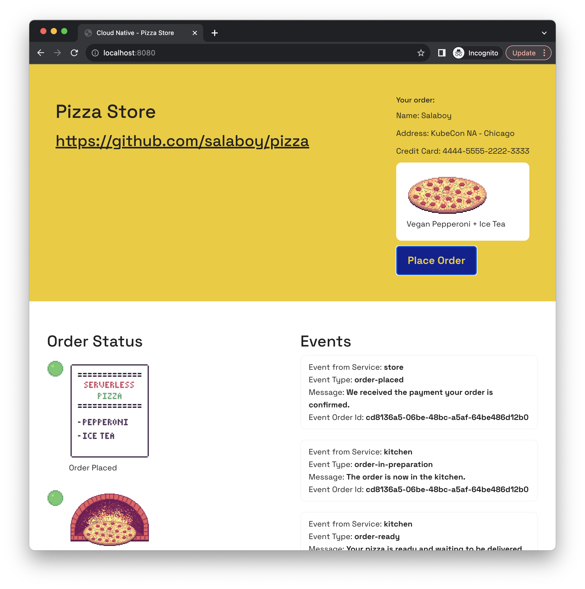

# Dapr Shared with KinD
This tutorial provides step-by-step instructions for installing Dapr Shared for a simple application composed with 3 services.

## Prerequisites and Installation

Before proceeding, please make sure that you have the necessary tools installed on your system. We will create a local KinD cluster to install Dapr, some applications, and an instance of Dapr Shared.

To get started, make sure you have the following CLIs installed:

- [Docker](https://www.docker.com/)

- [KinD (Kubernetes in Docker)](https://kind.sigs.k8s.io/docs/user/quick-start/)

- [kubectl](https://kubernetes.io/docs/tasks/tools/)

- [Helm](https://helm.sh/docs/intro/install/)


## Creating a local Kubernetes cluster with KinD: 

Here, you will create a simple Kubernetes cluster with KinD defaults running the following command:

```bash
  kind create cluster
```

Make sure to install the Dapr Control Plane into the cluster with: 

```
helm repo add dapr https://dapr.github.io/helm-charts/
helm repo update
helm upgrade --install dapr dapr/dapr \
--version=1.12.3 \
--namespace dapr-system \
--create-namespace \
--wait
```


## Installing application-infrastructure (PostgreSQL and Kafka):

We will be using Kafka for sending messages between services: 

```
helm install kafka oci://registry-1.docker.io/bitnamicharts/kafka --version 22.1.5 --set "provisioning.topics[0].name=events-topic" --set "provisioning.topics[0].partitions=1" --set "persistence.size=1Gi" 
```

We will be using PostgreSQL as our persistent store, but before installing the PostgreSQL Chart run:

```
kubectl apply -f k8s/pizza-init-sql-cm.yaml
```

Then: 

```
helm install postgresql oci://registry-1.docker.io/bitnamicharts/postgresql --version 12.5.7 --set "image.debug=true" --set "primary.initdb.user=postgres" --set "primary.initdb.password=postgres" --set "primary.initdb.scriptsConfigMap=pizza-init-sql" --set "global.postgresql.auth.postgresPassword=postgres" --set "primary.persistence.size=1Gi"

```

## Installing Dapr Components

In this section, we will be configure two Dapr Components: [PubSub](https://docs.dapr.io/developing-applications/building-blocks/pubsub/pubsub-overview/) and [StateStore](https://docs.dapr.io/developing-applications/building-blocks/state-management/state-management-overview/). 

So before deploying our applications, let's configure the Statestore component to connect to PostgreSQL. 

Create the StateStore component by running:

```sh
kubectl apply -f k8s/statestore.yaml

```

Now we can create and configure the PubSub component to connect to Kafka. We can do this by applying this resource:

```sh
kubectl apply -f k8s/pubsub.yaml
```

Once configured the PubSub component, we can register Subscriptions to define who and where notifications will be sent when new messages arrive to the `notification` topic.

Create the Subscription resource applying this file to Kubernetes by running:

```sh
kubectl apply -f k8s/subscription.yaml
```

## Installing Dapr Shared and all applications

For each application service that needs to talk to the Dapr APIs we need to deploy a new Dapr Shared instance. Each instance have a one to one relationship with Dapr Application Ids. 

Let's create a new Dapr Shared instance for the Pizza Store service: 

```sh
helm install pizza-store-shared oci://docker.io/daprio/dapr-shared-chart --set shared.appId=pizza-store --set shared.remoteURL=pizza-store --set shared.remotePort=80
```

Let's do the same for the Kitchen Service: 

```sh
helm install pizza-kitchen-shared oci://docker.io/daprio/dapr-shared-chart --set shared.appId=kitchen-service --set shared.remoteURL=kitchen-service --set shared.remotePort=80
```


Finally, let's do the same for the Delivery Service:

```sh
helm install pizza-delivery-shared oci://docker.io/daprio/dapr-shared-chart --set shared.appId=delivery-service --set shared.remoteURL=delivery-service --set shared.remotePort=80
```


Now that we have our 3 Dapr Shared instances for our applicaation services, we can install the application Services. 

These are standard Kubernetes applications, using `Deployments` and `Services`.
```sh
  kubectl apply -f k8s/pizza-app.yaml
```

This install all the application services. To avoid dealing with Ingresses you can access the application by using `kubectl port-forward`, run to access the application on port `8080`: 

```
kubectl port-forward svc/pizza-store 8080:80
```

Then you can point your browser to [`http://localhost:8080`](http://localhost:8080) and you should see: 



If you want to see the implementation's detail, you [can access this repository](https://github.com/salaboy/piza).


## Get involved

If you want to contribute to Dapr Shared please get in touch, create an issue, or submit a Pull Request. 
You can also check the Project Roadmap to see what is coming or to find out how you can help us to get the next version done. 
